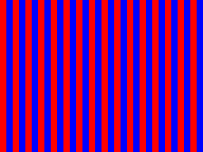
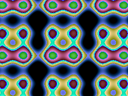
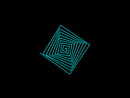
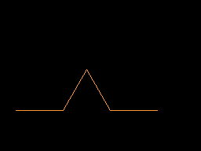
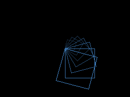
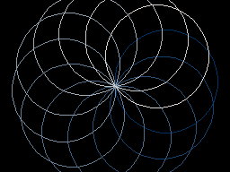

# PSIL - Point-free Stack-based Interpreted Language

## Changelog

### Phase 4 — Decouple Tiles from Occupants, Scale to 10,000 NPCs (2026-03-01)

The original tile encoding packed occupant ID in the high 4 bits, capping simulations at ~15 NPCs. Phase 4 removes this ceiling:

- **Tiles = pure terrain** — `Tile byte` uses all 8 bits for type (256 possible). `MakeTile(typ)` takes one arg. `Occupant()` deleted.
- **Separate occupancy grid** — `OccGrid []uint16` parallel to Grid. `OccAt()` / `SetOcc()` / `ClearOcc()` for movement and collision.
- **NPC.ID = uint16** — monotonically increasing, 65535 max. No wrapping or reuse.
- **O(1) NPC lookup** — `npcByID map[uint16]*NPC` replaces linear scans for target resolution, trade matching, and findNPC.
- **Cached tile counts** — `foodCount` / `itemCount` maintained by `SetTile()`, eliminating full-grid scans.
- **Bounded Manhattan ring search** — all `Nearest*` functions expand outward (radius 0-31, ~25 cells for typical hit) instead of scanning the full grid.
- **Combined NPC sensor** — `NearestNPCFull()` returns distance+ID+direction in one scan, eliminating 3x duplicate scans per NPC.
- **Auto-scale world** — `AutoWorldSize(npcs) = max(32, sqrt(npcs)*4)`. Default `--world 0` triggers auto-sizing. Maintains ~6% density at all scales.
- **Resource scaling** — `MaxFood = npcs*3`, `MaxItems = max(npcs/2, 4)`.
- **Cluster analysis skip** — O(n^2) clustering guarded with population > 500.

Performance: 100 NPCs in 3.5s, 1000 NPCs in 41s, 10000 NPCs completes without crash. Trades and teaches occur at all scales. See [Scaling to 10,000 NPCs](reports/2026-03-01-004-scaling-10k-npcs.md).

### Phase 3 — Max Age, Hazards, and Memetic Transmission (2026-03-01)

500k-tick simulations revealed **frozen evolution** — the best NPC lived 137k ticks, forager monoculture dominated all seeds, and trade was a one-shot event. Phase 3 breaks the stasis:

- **Max age (5000 ticks)** — forces NPC turnover so the GA keeps running. No more immortal foragers stalling evolution. Best NPC age now capped under 5000.
- **Poison tiles** — 1-in-10 item spawns are poison (15 damage on contact, consumed). Decay after 200 ticks. `Ring0Danger` (slot 6) reports nearest poison distance.
- **Blights** — every 1024 ticks, ~50% of food is destroyed. Creates periodic famine beyond winter.
- **Memetic transmission (ActionTeach=6)** — horizontal genome transfer. Adjacent NPCs copy 4-byte instruction-aligned fragments. Fitness-based probability (fitter teachers are more persuasive, fitter students resist). Costs 10 energy.
- **New sensors** — `Ring0MyAge` (slot 24: remaining life), `Ring0Taught` (slot 25: times genome was modified).
- **Teacher genome seeded** — 5% of population carries a teacher genome that teaches adjacent NPCs when holding an item.
- **Fitness rewards teaching** — `+TeachCount*15` in fitness formula.
- **Aged-out replacement in GA** — NPCs at MaxAge are replaced even if not bottom 25%.

Result: trades re-emerge across all seeds (40-326 per 50k run, up from 1). Teach events 3-16 per seed. No NPC lives past 5000 ticks. See [Simulation Observations](reports/2026-03-01-003-simulation-observations.md).

### Phase 2 — Evolve Smarter: Portable Crafting, Seasonal Scarcity, Mutation Fix (2026-03-01)

50k-tick simulations revealed a **forager monoculture** — every seed converged to the same 8-byte genome that moves toward food and eats. No NPC ever traded, crafted, or did anything complex. Phase 2 fixes three root causes:

- **Mutation blind spot fixed** — `randomOpcode()` now generates ring ops (`r0@`, `r1!`) at 15%, so mutation can discover sensor reads and action writes. Constant tweak also adjusts 2-byte op operands.
- **Portable crafting** — `ActionCraft` works anywhere (free on forge, 20 energy off forge). Auto-craft triggers when any NPC walks onto a forge tile with a craftable item. No bytecode needed.
- **Seasonal scarcity** — Winter (last quarter of each 256-tick day cycle) stops all food spawning. Reduced `MaxFood` and `FoodRate` defaults. Tools/compasses now grant extended foraging radius (`1 + ModForage`), creating real survival advantage.
- **More forges** — `max(3, size/8)` forges instead of 1-2, increasing auto-craft encounters.
- **Fitness rewards crafting** — `gold*20` (was `*5`), `+craftCount*30`, craft bonus `+50` (was `+20`).
- **Gold inheritance** — offspring get `(parentA.Gold + parentB.Gold) / 4`, preserving economic memory.
- **Crafter genome seeded** — 10% of initial population carries a crafter genome that reads `Ring0OnForge` and crafts when possible.

Result: 7 of 8 item-holding NPCs now craft compasses. Zero crafted items in Phase 1. See [Simulation Observations](reports/2026-03-01-003-simulation-observations.md).

### Phase 1a-1d — Modifiers, Crystals, Crafting, Economy, Stress (2026-03-01)

- Modifier system: 4-slot fixed-size effect array (gas, forage, attack, defense, energy, health, stress)
- Crystal tiles: consumed on pickup, grant permanent +50 gas with diminishing returns
- Forge tiles and crafting: tool→compass, weapon→shield
- Stress system: combat stress, starvation stress, eating/trading/resting relief, output override at high stress
- Scarcity-based trade pricing: `MarketValue = 10 * totalItems / countOfThisType`
- See [Emergent Economies and Crafting](reports/2026-03-01-002-emergent-economies-and-crafting.md)

### Phase 0 — NPC Sandbox: Evolving Bytecode Brains (2026-03-01)

- 32x32 tile world with food, items, NPCs
- 26-slot Ring0 sensors, 4-slot Ring1 actions
- Genetic algorithm: tournament-3, instruction-aligned crossover, 6 mutation operators
- Bilateral trade with item swapping
- Seed genomes: forager, trader, random walker
- Go + Z80 cross-validated (identical Ring1 outputs)
- See [Emergent NPC Societies](reports/2026-03-01-001-emergent-npc-societies.md) — trade, knowledge, memetics, and deception on concatenative bytecode

### micro-PSIL Bytecode VM (2026-01-11)

- 1,552-byte Z80 VM running concatenative bytecode
- UTF-8-style opcode encoding (1-3 bytes)
- 4 test programs verified: arithmetic, hello, factorial, npc-thought
- See [micro-PSIL Bytecode VM](reports/2026-01-11-001-micro-psil-bytecode-vm.md) and [MinZ Feasibility](reports/2026-01-11-002-micro-psil-on-minz-feasibility.md)

### PSIL Language (2026-01-10)

- Concatenative stack-based language inspired by Joy
- Quotations, combinators, graphics, turtle graphics
- See [Design Rationale](reports/2026-01-10-001-psil-design-rationale.md)

---

PSIL is a concatenative, stack-based, point-free functional language inspired by Joy, designed for VM execution and targeting Z80/6502 compatibility.

## Features

- **Stack-based execution** - all operations work on an implicit stack
- **Quotations as first-class values** - code blocks `[ ... ]` can be passed, stored, and composed
- **Point-free style** - no named variables, only stack transformations
- **Hardware-inspired flags** - Z flag for booleans, C flag for errors, A register for error codes
- **Rich combinator library** - `ifte`, `linrec`, `while`, `map`, `filter`, `fold`
- **Graphics system** - create and render images with shader-style programming
- **Turtle graphics** - Logo-style turtle for L-systems and fractals
- **Math functions** - sin, cos, sqrt, pow, lerp, clamp, smoothstep, etc.
- **micro-PSIL bytecode VM** - compact bytecode for Z80/6502 implementation
- **CPS-compatible semantics** - designed for easy compilation to bytecode

## Quick Start

```bash
# Build
go build ./cmd/psil

# Run REPL
./psil

# Run a file
./psil examples/fibonacci.psil

# Run shader examples
./psil examples/shaders.psil
```

## Language Basics

```psil
% Numbers push to stack
42 3.14 -5

% Strings
"Hello, World!"

% Stack operations
dup     % duplicate top: a -> a a
drop    % remove top: a ->
swap    % swap top two: a b -> b a
over    % copy second: a b -> a b a
rot     % rotate three: a b c -> b c a
roll    % n roll: bring nth item to top
pick    % n pick: copy nth item to top

% Arithmetic
+ - * / mod neg abs

% Math functions
sin cos tan sqrt pow log exp
floor ceil round min max
clamp lerp smoothstep fract

% Comparison (sets Z flag)
< > <= >= = !=

% Quotations (code blocks)
[1 2 +]     % pushes quotation, doesn't execute
i           % execute quotation: [Q] i -> ...
call        % alias for i

% Definitions (three styles)
DEFINE sq == [dup *].       % Joy-style
[dup *] "sq" define         % Point-free with string
[dup *] 'sq define          % Point-free with quoted symbol

5 sq .      % prints 25

% Conditionals
[cond] [then] [else] ifte

% Recursion
[pred] [base] [rec1] [rec2] linrec
```

## Graphics System

PSIL includes a graphics system for creating and rendering images:

```psil
% Create 256x192 image
256 192 img-new

% Fill with color
255 0 0 img-fill            % fill with red

% Set individual pixels
dup 100 50 0 255 0 img-setpixel  % green pixel at (100,50)

% Render with shader quotation
% Shader receives: x y width height
% Shader returns: r g b
[
    drop drop               % x y
    swap 255 * 256 /        % r = x scaled
    swap 255 * 192 /        % g = y scaled
    128                     % b = constant
] img-render

% Save as PNG
"output/image.png" img-save
```

### Shader Examples

The `examples/shaders.psil` file demonstrates various shader effects:

| Gradient | Stripes | Checker | Plasma | Radial | Sphere |
|----------|---------|---------|--------|--------|--------|
|  |  |  |  |  |  |

Run them with:
```bash
mkdir -p output
./psil examples/shaders.psil
```

## Turtle Graphics

Logo-style turtle graphics for L-systems, fractals, and generative art:

```psil
256 192 img-new
0 0 0 img-fill
turtle                      % create turtle at center
255 255 0 pencolor          % yellow pen

5 [60 fd 144 rt] times      % draw a star

turtle-img "star.png" img-save
```

### Turtle Examples

| Square | Star | Spiral | Koch Curve |
|--------|------|--------|------------|
|  |  |  |  |

| Sierpinski | Tree | Nested Squares | Colorful Circles |
|------------|------|----------------|------------------|
|  |  |  |  |

Run them with:
```bash
./psil examples/turtle.psil
```

### Turtle Commands

| Command | Effect | Command | Effect |
|---------|--------|---------|--------|
| `fd n` | Forward n pixels | `bk n` | Backward n pixels |
| `rt n` | Turn right n degrees | `lt n` | Turn left n degrees |
| `pu` | Pen up (stop drawing) | `pd` | Pen down (draw) |
| `pencolor r g b` | Set pen color | `setxy x y` | Move to position |
| `setheading n` | Set heading | `home` | Return to center |

## Example: Factorial

```psil
DEFINE fact == [
    [dup 0 =]           % predicate: n == 0?
    [drop 1]            % base case: return 1
    [dup 1 -]           % before recursion: push n-1
    [*]                 % after recursion: multiply
    linrec
].

5 fact .    % prints 120
```

## Example: Fibonacci

```psil
DEFINE fib == [
    [dup 2 <]                         % n < 2?
    []                                % return n
    [dup 1 - fib swap 2 - fib +]     % fib(n-1) + fib(n-2)
    ifte
].

10 fib .    % prints 55
```

## Example: Plasma Shader

```psil
DEFINE plasma-shader == [
    drop drop               % x y
    over 16 / sin           % sin(x/16)
    over 16 / cos +         % + cos(y/16)
    rot 8 / cos +           % + cos(x/8)
    swap 8 / sin +          % + sin(y/8)
    1 + 2 / 255 *           % normalize to 0-255
    dup 1.2 * 255 mod       % r
    swap dup 0.8 * 50 + 255 mod  % g
    swap 1.5 * 100 + 255 mod     % b
].

256 192 img-new
[plasma-shader] img-render
"output/plasma.png" img-save
```

## Error Handling

PSIL uses hardware-inspired flags for error handling:

- **Z flag** - set by boolean operations (true = Z set)
- **C flag** - indicates error condition (true = error)
- **A register** - holds error code when C flag is set

```psil
% Error codes:
% 1 = stack underflow
% 2 = type mismatch
% 3 = division by zero
% 4 = undefined symbol
% 5 = gas exhausted
% 7 = image error
% 8 = file error

% Check for errors
err?        % push C flag as boolean
errcode     % push A register (error code)
clearerr    % clear error state

% Try/catch pattern
[risky-code] [error-handler] try
```

## REPL Commands

```
:help       Show help
:quit       Exit REPL
:stack      Show current stack
:flags      Show Z, C flags and A register
:clear      Clear stack and reset flags
:debug      Toggle debug mode
:words      List defined words
:load file  Load and execute a file
:gas n      Set gas limit (0 = unlimited)
```

## Building for Development

```bash
# Run tests
go test ./...

# Run with debug mode
./psil -debug

# Set gas limit for computation
./psil -gas 10000
```

## Builtins Reference

### Stack Operations
`dup`, `drop`, `swap`, `over`, `rot`, `nip`, `tuck`, `dup2`, `drop2`, `clear`, `depth`, `roll`, `unroll`, `pick`

### Arithmetic
`+`, `-`, `*`, `/`, `mod`, `neg`, `abs`, `inc`, `dec`

### Math Functions
`sin`, `cos`, `tan`, `asin`, `acos`, `atan`, `atan2`, `sqrt`, `pow`, `exp`, `log`, `floor`, `ceil`, `round`, `min`, `max`, `clamp`, `lerp`, `sign`, `fract`, `smoothstep`

### Comparison
`<`, `>`, `<=`, `>=`, `=`, `!=`

### Logic
`and`, `or`, `not`

### Quotation Operations
`i`, `call`, `x`, `dip`, `concat`, `cons`, `uncons`, `first`, `rest`, `size`, `null?`, `quote`, `unit`

### List Operations
`reverse`, `nth`, `take`, `ldrop`, `split`, `zip`, `zipwith`, `range`, `iota`, `flatten`, `any`, `all`, `find`, `index`, `sort`, `last`

### Combinators
`ifte`, `linrec`, `binrec`, `genrec`, `primrec`, `tailrec`, `while`, `times`, `loop`, `map`, `fold`, `filter`, `each`, `step`, `infra`, `cleave`, `spread`, `apply`

### Graphics
`img-new`, `img-setpixel`, `img-getpixel`, `img-save`, `img-width`, `img-height`, `img-fill`, `img-render`, `image?`

### Turtle Graphics
`turtle`, `fd`, `bk`, `lt`, `rt`, `pu`, `pd`, `pencolor`, `setxy`, `setheading`, `home`, `turtle-img`

### I/O
`.`, `print`, `newline`, `stack`

### Error Handling
`err?`, `errcode`, `clearerr`, `onerr`, `try`

### Definition
`define`, `undefine`

## micro-PSIL: Bytecode VM for Z80

### Why a Bytecode VM on a Z80?

The Z80 runs at 3.5 MHz with 48K of RAM. Every byte matters. A naive interpreter — tokenizing strings, hashing symbol names, walking tree structures — would burn most of that capacity on overhead. But a well-designed bytecode VM inverts the equation: the interpreter becomes a tight fetch-decode-execute loop, and the *programs* compress down to something approaching information-theoretic density.

micro-PSIL's encoding is modeled on UTF-8. The most common operations — stack manipulation, small arithmetic, boolean tests — are single bytes. A complete NPC decision ("if health < 10 and enemy nearby, flee; else fight") compiles to **21 bytes** of bytecode plus quotation bodies. The entire VM core is **1,552 bytes** of Z80 machine code. That leaves ~45K for game data, maps, and hundreds of NPC behavior scripts.

### NPC Brains as Concatenative Programs

The real motivation is AI for NPCs — not the modern neural-net kind, but something closer to what "artificial intelligence" meant in the 1980s: small programs that make creatures seem alive.

In most retro games, NPC behavior is a hardcoded state machine: `IF health < 10 THEN flee`. The transitions are fixed at compile time. The designer writes every possible behavior. Nothing emerges.

micro-PSIL changes this by making behavior *data*. Each NPC carries a bytecode program — its "brain." The VM runs the brain each tick, the NPC reads its sensors (health, enemy distance, hunger), the brain computes a decision, the NPC acts. Different NPCs can carry different programs. A cautious goblin's brain might be:

```
'health @ 10 < 'enemy @ and [flee] [patrol] ifte    ; 12 bytes
```

An aggressive one:

```
'enemy @ [charge] [wander] ifte                      ; 6 bytes
```

The concatenative model makes this unusually powerful because **composition is concatenation**. You don't need a compiler, linker, or symbol resolver to combine behaviors — you literally append bytecode arrays. Want a goblin that checks hunger *before* checking for enemies? Prepend a hunger-check snippet:

```
brain_a = 'hunger @ 20 > [eat] [...] ifte   ; hungry? eat first
brain_b = 'enemy @ [charge] [wander] ifte   ; then fight or wander
brain_ab = brain_a ++ brain_b               ; just concatenate the bytes
```

No variable conflicts. No calling conventions. No scope. The stack is the only interface between the two fragments, and stack effects are local and composable. This is a property unique to concatenative languages — in any applicative language (C, Lisp, Python), combining two code fragments requires managing shared names.

### Genetic Programming on a Z80

This composability opens the door to something that would be absurdly impractical in most languages: **genetic programming on the Z80 itself.**

A bytecode brain is just a byte array. You can:

- **Mutate** it: flip a random byte (change `+` to `*`, change a constant, swap a quotation ref)
- **Crossover** two brains: take the first half of parent A and the second half of parent B
- **Measure fitness**: run the brain in a simulated tick, see if the NPC survived, found food, or died

Because the bytecode is well-formed at every granularity (every byte is either a complete instruction or a prefix that the VM knows how to skip), random mutations produce *valid programs* far more often than in tree-based representations. Single-byte instructions like `dup`, `swap`, `+`, `<` are atomic and self-contained. Even a completely random 20-byte sequence will execute without crashing — it might not do anything useful, but it won't segfault. The VM has a gas counter to prevent infinite loops.

This means you could run a genetic algorithm *in-game, on the Z80*:

1. A population of 20 NPCs, each with a 30-byte brain
2. Every N ticks, score them (survived? found food? killed enemy?)
3. Top 5 reproduce: crossover + mutation → 20 new brains
4. Total memory: 20 × 30 = **600 bytes** for the entire population's genomes

After a few generations, the NPCs evolve behaviors the designer never wrote. The cautious ones learn to flee. The aggressive ones learn to charge. Some discover strategies like "flee when hurt, charge when healthy" — emergent `ifte` patterns that arise from selection pressure, not from a programmer typing `if`.

The entire genetic algorithm (selection, crossover, mutation, fitness evaluation) fits in maybe 200 bytes of Z80 code. The VM is already there. The bytecode programs *are* the genomes. There is no separate representation to maintain.

This is the kind of thing that was theoretically possible in the 1980s but never practical because game behavior was written in assembly — you can't mutate Z80 machine code and expect anything but a crash. A bytecode VM creates exactly the abstraction layer needed: a safe, compact, composable representation that can be both executed and evolved.

### The Inner Loop

The concatenative model maps directly to the Z80's sequential execution. The VM's inner loop is:

```
fetch:  LD A, (bc_pc) / INC bc_pc
decode: CP $20 / JP C, command_table
        CP $40 / JR C, push_small_number
        ...
```

Quotations (code blocks) are stored as separate bytecode arrays referenced by index. `[0]` pushes quotation reference 0 onto the stack. `exec` pops it and runs it. `ifte` pops a condition and two quotation refs, runs one or the other. The Z80 implementation saves/restores the bytecode PC on the machine stack — quotation calls nest naturally using the same hardware stack the CPU already has.

### Building and Running

```bash
# Go reference VM
go build ./cmd/micro-psil
./micro-psil examples/micro/arithmetic.mpsil
./micro-psil -disasm examples/micro/npc-thought.mpsil

# Compile to bytecode
go run tools/compile_mpsil/main.go -o z80/build examples/micro/arithmetic.mpsil

# Run on Z80 (via mzx emulator)
mzx --run z80/build/vm.bin@8000 \
    --load z80/build/arithmetic.bin@9000 \
    --console-io --frames DI:HALT
```

### Bytecode Format

| Range | Length | Usage |
|-------|--------|-------|
| `00-1F` | 1 byte | Commands (dup, swap, +, -, *, <, ifte, exec...) |
| `20-3F` | 1 byte | Small numbers 0-31 |
| `40-5F` | 1 byte | Symbols (health, energy, enemy, fear...) |
| `60-7F` | 1 byte | Quotation refs [0]-[31] |
| `80-BF` | 2 bytes | Extended ops (push.b, jmp, jz, call builtin) |
| `C0-DF` | 3 bytes | Far ops (push.w, far jumps) |
| `F0-FF` | 1 byte | Special (halt, yield, end) |

### NPC Thought Example

```asm
; "If health < 10 AND enemy nearby, flee; otherwise fight"
8 5 !               ; health = 8
1 12 !              ; enemy = 1

'health @           ; load health       → 45 17
10 <                ; less than 10?     → 2A 0C
'enemy @            ; load enemy flag   → 4C 17
and                 ; both true?        → 0E
[0] [1]             ; [flee] [fight]    → 60 61
ifte                ; conditional       → 13
halt                ;                   → F0
```

The decision logic compiles to **10 bytes**. The VM executes it, prints `Flee!`.

### Z80 VM Architecture

```
Memory Map:
  $8000-$8FFF  VM code (1,552 bytes)
  $9000-$91FF  Bytecode program (loaded)
  $9200-$97FF  Quotation blob (loaded)
  $B000-$B0FF  VM value stack (128 × 16-bit entries)
  $B100-$B17F  Memory slots (64 × 16-bit)
  $B180-$B1BF  Quotation pointer table (32 entries)

I/O: OUT ($23), A via mzx --console-io (no ROM needed)
```

### Test Results

All programs verified against the Go reference VM:

| Program | Bytecode | Output | What it tests |
|---------|----------|--------|---------------|
| arithmetic | 49 bytes | `5 6 56 20 45 25 4` | Stack ops, +, -, *, /, dup, swap |
| hello | 51 bytes | `Hello World!` | Character output via builtins |
| factorial | 7 + 14 bytes | `120` | Recursive quotation, loop, dec, * |
| npc-thought | 21 + 76 bytes | `Flee!` | Memory, ifte, 3 quotations |

### Prebuilt Binaries

The `z80/build/` directory contains ready-to-run binaries:

| File | Size | Description |
|------|------|-------------|
| `vm.bin` | 1,552 B | Z80 micro-PSIL VM (load at $8000) |
| `arithmetic.bin` | 49 B | Arithmetic test (load at $9000) |
| `hello.bin` | 51 B | Hello World (load at $9000) |
| `factorial.bin` | 7 B | Factorial main (load at $9000) |
| `factorial_quots.bin` | 14 B | Factorial quotations (load at $9200) |
| `npc-thought.bin` | 21 B | NPC thought main (load at $9000) |
| `npc-thought_quots.bin` | 76 B | NPC thought quotations (load at $9200) |

See [micro-PSIL Design Report](reports/2026-01-11-001-micro-psil-bytecode-vm.md) and [MinZ Feasibility Analysis](reports/2026-01-11-002-micro-psil-on-minz-feasibility.md) for details.

## NPC Sandbox: Evolving Bytecode Brains

The theory from the sections above is now real. `pkg/sandbox` implements a complete genetic programming sandbox where a population of NPCs with bytecode genomes live in an auto-scaled tile world (32x32 to 400x400, ~6% density), sense their environment through Ring0 sensors, make decisions by running their genome on the micro-PSIL VM, act on the world through Ring1 outputs, and evolve via genetic algorithms. Scales from 20 to 10,000+ NPCs. The same simulation runs on both Go and Z80.

### How It Works

Each tick of the simulation:

1. **Sense** — the world fills 26 Ring0 slots with NPC sensor data (health, energy, hunger, distances, items, stress, RNG, gas capacity, forge proximity)
2. **Think** — the NPC's bytecode genome runs on a fresh VM with gas = base + crystal bonus (diminishing returns, cap 500)
3. **Stress check** — if stress > 30, there's a `(stress-30)%` chance the brain's output is overridden with random movement/action
4. **Act** — the scheduler reads Ring1 outputs (move direction, action type, target) and applies them: movement, item pickup, crystal absorption, combat (with defense modifiers), trading, crafting
5. **Auto-actions** — NPCs passively eat food within foraging radius (`1 + ModForage`); auto-craft when standing on forge with craftable item
6. **Modifiers** — per-tick modifiers (energy, health, stress) apply; durations tick down; expired modifiers clear
7. **Decay** — energy drains; starvation (energy < 50) adds stress; resting (energy > 150) reduces stress
8. **Economy** — bilateral trades transfer items with scarcity-based gold pricing; trading reduces stress
9. **Fitness** — scored as `age + food*10 + health + gold*20 + craftCount*30 - stress/5`

Every N ticks, the GA replaces the bottom 25% with offspring from the top 50% via tournament selection, instruction-aligned crossover, and six mutation operators.

### Ring0 Sensors (read-only, filled by world)

| Slot | Name | Meaning |
|------|------|---------|
| 0 | self | NPC ID |
| 1 | health | current health (0-100) |
| 2 | energy | current energy (0-200) |
| 3 | hunger | ticks since last ate |
| 4 | fear | nearest enemy distance |
| 5 | food | nearest food distance |
| 6 | danger | danger level |
| 7 | near | nearest NPC distance |
| 8 | x | X position |
| 9 | y | Y position |
| 10 | day | tick mod cycle |
| 12 | near_id | nearest NPC ID |
| 13 | food_dir | direction toward nearest food |
| 14 | my_gold | gold count |
| 15 | my_item | held item type |
| 16 | near_item | nearest item distance |
| 17 | near_trust | trust (stub) |
| 18 | near_dir | direction toward nearest NPC |
| 19 | item_dir | direction toward nearest item |
| 20 | rng | per-NPC random 0-31 |
| 21 | stress | current stress (0-100) |
| 22 | my_gas | effective gas (base + crystal bonuses) |
| 23 | on_forge | 1 if standing on forge tile |
| 24 | my_age | remaining life (MaxAge - age) |
| 25 | taught | times genome was modified by others |

### Ring1 Actions (writable, read by scheduler)

| Slot | Meaning | Values |
|------|---------|--------|
| 0 | move | 0=none, 1=N, 2=E, 3=S, 4=W |
| 1 | action | 0=idle, 1=eat, 2=attack, 3=share, 4=trade, 5=craft, 6=teach |
| 2 | target | target NPC ID |
| 3 | emotion | emotional state |

### Modifier System

NPCs carry up to 4 concurrent modifiers — a flat, fixed-size effect system with no heap allocation. Items, tiles, and temporary buffs all share the same `Modifier{Kind, Mag, Duration, Source}` struct.

| Kind | Constant | Example |
|------|----------|---------|
| Gas | 1 | Crystal (+50 gas permanently) |
| Forage | 2 | Tool (+1), Compass (+2) |
| Attack | 3 | Weapon (+10 damage) |
| Defense | 4 | Shield (+5 damage reduction) |
| Energy | 5 | Shrine buff (+10/tick temporary) |
| Health | 6 | Poison (-5/tick), Regen (+2/tick) |
| Stealth | 7 | Cloak (detection range) |
| Trade | 8 | Treasure (+3 gold per trade) |
| Stress | 9 | Combat stress (+15 one-shot) |

Passive modifiers (Gas, Forage, Attack, Defense, Trade) are read at point of use via `ModSum(kind)`. Per-tick modifiers (Energy, Health, Stress) are applied each tick. When an NPC picks up/trades/crafts an item, the old modifier is removed and the new one granted automatically.

### Items, Tiles, and Crafting

| Item | Type | Modifier | Source |
|------|------|----------|--------|
| Tool | 2 | Forage +1 | Ground tile |
| Weapon | 3 | Attack +10 | Ground tile |
| Treasure | 4 | Trade +3 | Ground tile |
| Crystal | 5 | Gas +50 (permanent) | Rare ground tile (1-in-20), consumed on pickup |
| Shield | 6 | Defense +5 | Crafted: Weapon on Forge |
| Compass | 7 | Forage +2 | Crafted: Tool on Forge |

**Forge tiles** (`max(3, size/8)` per world) are permanent landmarks. Crafting works anywhere: free on forge, costs 20 energy off forge. NPCs auto-craft when standing on a forge with a craftable item. Crafting grants +50 fitness and increments `CraftCount`.

### Economy

Trade gold is proportional to scarcity: `MarketValue = 10 * totalItems / countOfThisType`. When two NPCs trade, the value difference flows as gold — the NPC receiving the rarer item pays more. This creates emergent price discovery.

### Seed Genomes

Three hand-written seed genomes in `testdata/sandbox/` demonstrate the sensor-action loop:

**Forager** (9 bytes) - moves South, always eats:
```asm
r0@ 5       ; read food distance
3           ; push 3 (South)
r1! 0       ; write move direction
1           ; push 1 (eat)
r1! 1       ; write action
yield
```

**Flee** (9 bytes) - moves North to escape:
```asm
r0@ 4       ; read fear distance
1           ; push 1 (North)
r1! 0       ; write move direction
0           ; push 0 (idle)
r1! 1       ; write action
yield
```

**Random Walker** (12 bytes) - direction changes with the day counter:
```asm
r0@ 10      ; read day counter
4           ; push 4
mod         ; day mod 4
1           ; push 1
+           ; +1 (directions are 1-4)
r1! 0       ; write move direction
1           ; push 1 (eat)
r1! 1       ; write action
yield
```

### Running the Go Sandbox

```bash
# Quick test (100 ticks, 10 NPCs, auto-sized 32x32 world)
go run ./cmd/sandbox --npcs 10 --ticks 100 --seed 42 --verbose

# Full evolution run with economy (10k ticks, 20 NPCs)
go run ./cmd/sandbox --npcs 20 --ticks 10000 --seed 42 --verbose

# With spatial snapshots showing forge/crystal tiles
go run ./cmd/sandbox --npcs 20 --ticks 10000 --seed 42 --verbose --snap-every 2500

# Scale series (auto-sized worlds)
go run ./cmd/sandbox --npcs 100 --ticks 10000 --seed 42    # 40x40 world, ~3.5s
go run ./cmd/sandbox --npcs 1000 --ticks 10000 --seed 42   # 128x128 world, ~41s
go run ./cmd/sandbox --npcs 10000 --ticks 1000 --seed 42   # 400x400 world, ~69s

# Fixed world size (override auto-scale)
go run ./cmd/sandbox --npcs 100 --world 64 --ticks 5000 --seed 42
```

The verbose output shows NPC table with stress, gold, items (including crafted shield/compass), forge (`F`) and crystal (`*`) tiles on the map, and scarcity-based trade pricing. World size defaults to auto-scale (`--world 0`); set explicitly to override.

### Running the Z80 Sandbox

The same simulation runs on the Z80 in 2,818 bytes of machine code:

```bash
# Assemble
sjasmplus z80/sandbox.asm --raw=z80/build/sandbox.bin

# Run (16 NPCs, 500 ticks, evolve every 128 ticks)
mzx --run z80/build/sandbox.bin@8000 --console-io --frames DI:HALT
```

Z80 output:
```
NPC Sandbox Z80
T=128 A=2
T=256 A=0
T=384 A=0
Done
```

The Z80 version runs 16 NPCs on a 32x32 grid with a simplified GA (tournament-2 selection, point mutation). The entire sandbox — VM, scheduler, GA, world grid, NPC table — fits in under 3K of Z80 code.

### Genetic Algorithm

The GA engine (`pkg/sandbox/ga.go`) implements:

- **Tournament selection**: pick 3 random NPCs, best fitness wins
- **Instruction-aligned crossover**: walks both parent genomes opcode-by-opcode to find valid split points, then concatenates prefix of parent A with suffix of parent B
- **Six mutation operators**:
  1. Point mutation — replace one byte with a random valid opcode
  2. Insert — add a random opcode at a random position
  3. Delete — remove one byte (if genome > 16 bytes)
  4. Constant tweak — find a small number (0x20-0x3F) and adjust by +/-1
  5. Block swap — swap two instruction-aligned segments
  6. Block duplicate — copy a short segment to another position

Genome size is enforced between 16 and 128 bytes.

### Cross-Validation

The seed genomes are cross-validated between Go and Z80 VMs (`testdata/sandbox/crossval_test.go`). Both VMs produce identical Ring1 outputs for the same genome and Ring0 inputs, confirming bytecode compatibility.

### Files

| File | Description |
|------|-------------|
| `pkg/sandbox/world.go` | Auto-scaled tile world, OccGrid, bounded search |
| `pkg/sandbox/npc.go` | NPC struct, Ring0/Ring1 slot definitions |
| `pkg/sandbox/scheduler.go` | Tick loop: sense, think, act, decay |
| `pkg/sandbox/ga.go` | Genetic algorithm engine |
| `pkg/sandbox/sandbox_test.go` | Unit + e2e + scaling tests (36+ tests) |
| `cmd/sandbox/main.go` | CLI runner with flags |
| `z80/sandbox.asm` | Z80 sandbox (scheduler + world + NPC init) |
| `z80/ga.asm` | Z80 GA (tournament-2, point mutation) |
| `testdata/sandbox/*.mpsil` | Seed genomes (forager, flee, random, trader) |
| `testdata/sandbox/crossval_test.go` | Cross-validation tests |
| `z80/build/sandbox.bin` | Prebuilt Z80 binary (2,818 bytes) |

## Architecture

```
Source Code (.psil)          micro-PSIL (.mpsil)        Seed Genomes
    |                              |                        |
    v                              v                        v
Parser (Participle v2)       Assembler (pkg/micro)     GA Engine
    |                              |                   (pkg/sandbox/ga)
    v                              v                        |
AST (typed structs)          Bytecode (.bin)                v
    |                              |                   NPC Sandbox
    v                              v                   (pkg/sandbox)
Go Interpreter               Z80 VM (1,552 bytes)          |
    |                              |                   Sense → Think → Act → Evolve
    v                              v                        |
REPL / Files                 mzx emulator / real hw    Go + Z80
```

## Documentation

### Design Reports

See [`reports/`](reports/) for detailed design documentation:

| Report | Description |
|--------|-------------|
| [PSIL Design Rationale](reports/2026-01-10-001-psil-design-rationale.md) | Theoretical foundations and language design |
| [micro-PSIL Bytecode VM](reports/2026-01-11-001-micro-psil-bytecode-vm.md) | Bytecode format, encoding, Z80 implementation |
| [micro-PSIL on MinZ](reports/2026-01-11-002-micro-psil-on-minz-feasibility.md) | Feasibility analysis for MinZ compiler/VM |
| [Emergent NPC Societies](reports/2026-03-01-001-emergent-npc-societies.md) | Trade, knowledge, memetics, and deception on concatenative bytecode |
| [Scaling to 10,000 NPCs](reports/2026-03-01-004-scaling-10k-npcs.md) | Decoupled tiles, bounded search, auto-scale architecture |

### Guides & Plans

| Document | Description |
|----------|-------------|
| [ZX Spectrum Game Integration](docs/guide-zx-game-integration.md) | Integrating micro-PSIL NPC brains into ZX Spectrum games |
| [Emergent Societies Genplan](docs/genplan-emergent-societies.md) | 8-phase implementation plan: Go first, then Z80 port |

### Architecture Decision Records

See [`docs/adr/`](docs/adr/) for architectural decisions:

| ADR | Title |
|-----|-------|
| [ADR-001](docs/adr/001-bytecode-encoding.md) | UTF-8 Style Bytecode Encoding |
| [ADR-002](docs/adr/002-stack-format.md) | Tagged Stack Value Format |
| [ADR-003](docs/adr/003-symbol-slots.md) | Fixed Symbol Slots for NPC State |

## License

MIT
