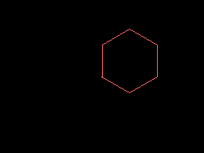

# PSIL Examples

This directory contains example programs demonstrating PSIL's features.

## Running Examples

```bash
# Build PSIL first
go build ./cmd/psil

# Run any example
./psil examples/hello.psil
./psil examples/fibonacci.psil
./psil examples/shaders.psil
./psil examples/turtle.psil
```

## Basic Examples

| File | Description |
|------|-------------|
| `hello.psil` | Hello World - basic output |
| `fibonacci.psil` | Fibonacci sequence with recursion |
| `factorial.psil` | Factorial using `linrec` combinator |
| `stdlib.psil` | Standard library definitions |

## Shader Examples (`shaders.psil`)

PSIL's graphics system allows shader-style programming where a quotation is applied to each pixel.

| Shader | Output |
|--------|--------|
| **Gradient** - XY color mapping |  |
| **Stripes** - Horizontal bands |  |
| **Checkerboard** - Classic pattern |  |
| **Radial** - Distance from center |  |
| **Plasma** - Demoscene effect |  |
| **Sphere** - 3D SDF rendering |  |

## Turtle Graphics (`turtle.psil`)

Logo-style turtle graphics for L-systems, fractals, and generative art.

### Basic Shapes

| Shape | Code | Output |
|-------|------|--------|
| **Square** | `4 [50 fd 90 rt] times` |  |
| **Star** | `5 [60 fd 144 rt] times` |  |
| **Hexagon** | `6 [40 fd 60 rt] times` |  |

### Spirals and Patterns

| Pattern | Description | Output |
|---------|-------------|--------|
| **Spiral** | Expanding spiral with increasing step size |  |
| **Nested Squares** | Rotated squares with rainbow colors |  |
| **Colorful Circles** | 12 overlapping colored circles |  |

### L-Systems and Fractals

| Fractal | Description | Output |
|---------|-------------|--------|
| **Koch Curve** | Classic snowflake fractal segment |  |
| **Sierpinski** | Triangle outline |  |
| **Simple Tree** | Y-shaped branching tree |  |
| **Dragon Curve** | Dragon fractal approximation |  |

## Turtle Commands Reference

| Command | Stack Effect | Description |
|---------|--------------|-------------|
| `turtle` | `image -> turtle` | Create turtle at center |
| `fd` | `turtle n -> turtle` | Move forward n pixels |
| `bk` | `turtle n -> turtle` | Move backward n pixels |
| `rt` | `turtle n -> turtle` | Turn right n degrees |
| `lt` | `turtle n -> turtle` | Turn left n degrees |
| `pu` | `turtle -> turtle` | Pen up (stop drawing) |
| `pd` | `turtle -> turtle` | Pen down (start drawing) |
| `pencolor` | `turtle r g b -> turtle` | Set pen color (0-255) |
| `setxy` | `turtle x y -> turtle` | Move to position |
| `setheading` | `turtle n -> turtle` | Set heading (degrees) |
| `home` | `turtle -> turtle` | Return to center |
| `turtle-img` | `turtle -> image` | Extract canvas |

## Graphics Commands Reference

| Command | Stack Effect | Description |
|---------|--------------|-------------|
| `img-new` | `w h -> image` | Create new image |
| `img-fill` | `image r g b -> image` | Fill with color |
| `img-setpixel` | `image x y r g b -> image` | Set pixel |
| `img-render` | `image [shader] -> image` | Apply shader to all pixels |
| `img-save` | `image filename -> image` | Save as PNG |
