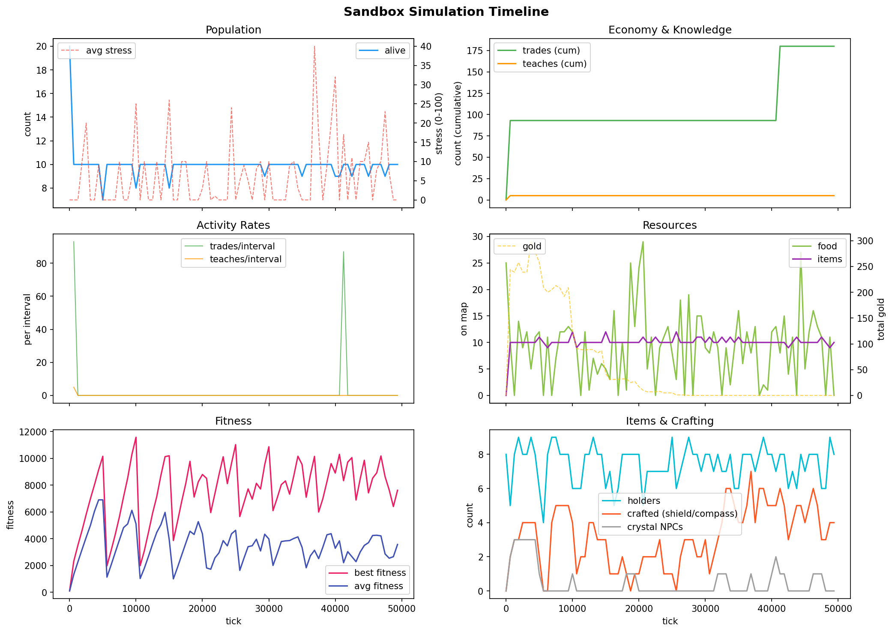
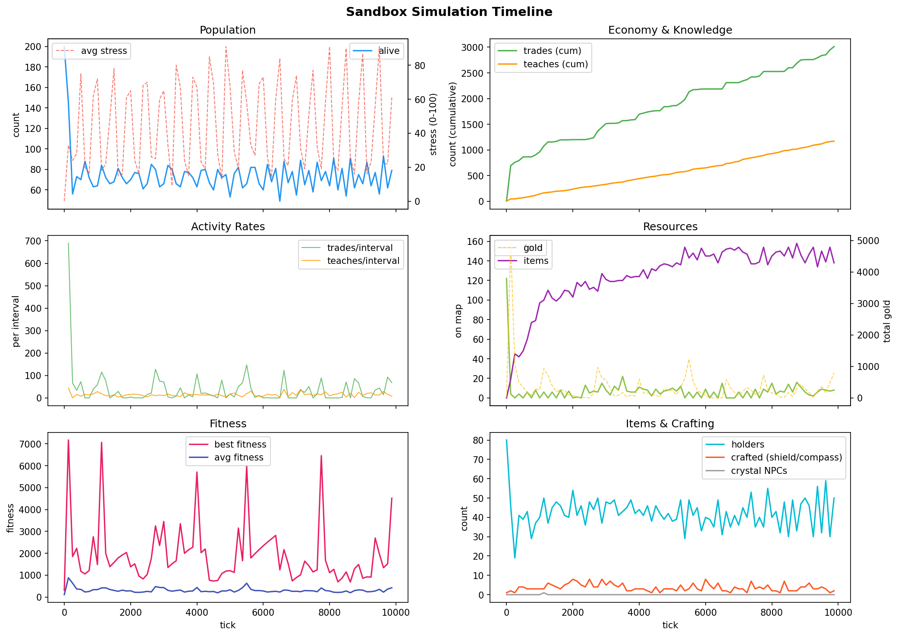
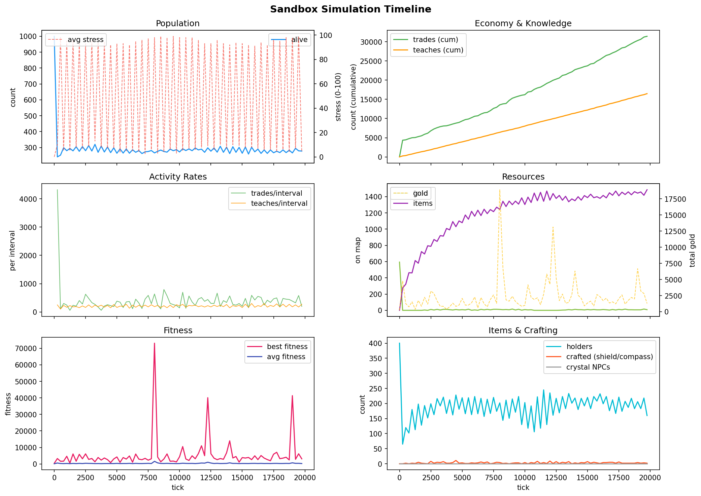
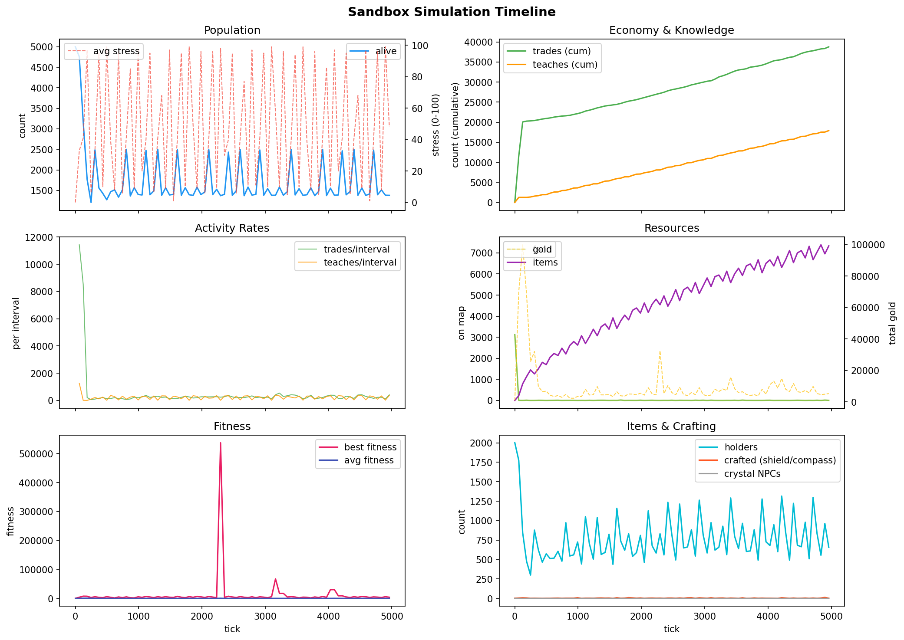
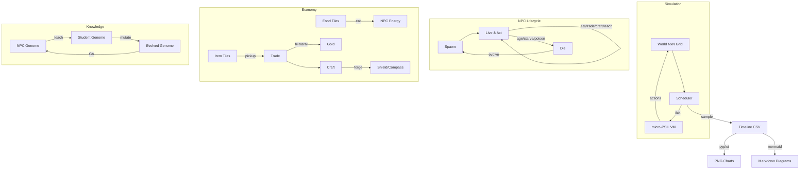

# Temporal Dynamics: Watching Civilizations Rise and Fall

**Date:** 2026-03-01
**Status:** Empirical observations
**Previous:** [Simulation Observations](2026-03-01-003-simulation-observations.md), [Scaling to 10,000 NPCs](2026-03-01-004-scaling-10k-npcs.md)
**Tools:** `--timeline`, `--csv`, `tools/plot_timeline.py`, `tools/mermaid_timeline.py`

---

## The Story in One Image

Every simulation tells the same story: a brief golden age, then collapse, then a long steady state where the survivors grind on. But the *details* change dramatically with scale.

### 20 NPCs, 50k Ticks — The Village



A quiet village. Population drops from 20 to 10 within 300 ticks and never recovers. Food is abundant, stress is low, trade is a memory. The forager monoculture reigns supreme. This is the world described in [Simulation Observations](2026-03-01-003-simulation-observations.md) — a world where nothing happens after the first 200 ticks.

```
alive       [20→10]     ██▇▆▅▅▅▅▅▅▅▅▅▅▅▅▅▅▅▅▅▅▅▅▅▅▅▅▅▅▅▅▅▅▅▅▅▅▅▅
trades      [0→180]     ▁█████████████████████████████████████████
food        [23→5]      ████▂▁▁▁▁▁▁▁▁▁▁▁▁▁▁▁▁▁▁▁▁▁▁▁▁▁▁▁▁▁▁▁▁▁▁▁
stress      [0→10]      ▁▁▁▁▁▁▁▁▁▁▁▁▁▁▁▁▁▁▁▁▁▁▁▁▁▁▁▁▁▁▁▁▁▁▁▁▁▁▁▁
```

**Final stats:** alive=10, trades=180, teaches=5, gold=0, avg_stress=10, crafted=5

### 200 NPCs, 10k Ticks — The Town



The first sign of real dynamics. Population crashes from 200 to ~60-80 and oscillates with the GA respawn cycle. Trade is **sustained** — 3,056 trades over the full run, not just the opening burst. Teaching reaches 1,174 events. Stress spikes to 80+ as food competition intensifies. The economy is alive.

```
alive       [200→79]    █▅▁▂▁▂▂▁▁▂▂▁▁▂▂▁▁▂▂▁▁▂▂▁▁▂▂▁▁▂▂▂▁▂▂▁▁▂▂▂
trades      [3→3013]    ▁▂▂▂▃▃▃▃▃▃▃▃▃▃▃▃▃▃▃▃▃▃▄▄▄▄▄▄▄▄▄▄▄▄▅▅▅▅▅▅
trades/t    [689→68]    █▁▁▁▁▁▁▁▂▁▁▁▁▁▁▁▁▁▁▁▁▂▁▁▁▁▁▁▁▁▁▂▁▁▁▁▁▁▁▁
stress      [0→61]      ▁▃▂▃▆▂▂▅▆▂▂▄▇▂▂▅▆▂▂▆▆▃▂▅▆▃▁▇▆▂▂▆▆▂▂▇▆▃▂█
items       [0→138]     ▁▁▂▂▃▃▄▄▅▅▅▅▅▅▅▅▅▆▆▆▅▆▅▆▆▆▆▆▆▆▆▆▆▆▆▆▆▆▇▇
```

**Final stats:** alive=62, trades=3,056, teaches=1,174, gold=931, avg_stress=80, crafted=3 (compasses!)

**The stress oscillation** is the most striking feature at this scale. It follows a sawtooth pattern synchronized with the 256-tick day cycle — winter food shortages create famine stress, then spring brings relief. At 20 NPCs this doesn't happen because food is too abundant relative to population.

### 1,000 NPCs, 20k Ticks — The City



Everything accelerates. Trade volume hits **31,993** — an economy ten times the size of the town. Teaching reaches **16,642** events, meaning genome fragments are flowing constantly between NPCs. The city never sleeps.

```
alive       [1000→278]  █▁▁▁▁▁▁▁▁▁▁▁▁▁▁▁▁▁▁▁▁▁▁▁▁▁▁▁▁▁▁▁▁▁▁▁▁▁▁▁
trades      [23→31426]  ▁▁▁▂▂▂▂▂▂▂▂▂▂▂▂▂▂▂▂▂▃▃▃▃▃▃▃▃▃▃▃▃▄▄▄▄▄▄▄▄
teaches     [1→16484]   ▁▁▁▁▁▁▁▁▁▁▁▁▁▂▂▂▂▂▂▂▂▂▂▂▃▃▃▃▃▃▃▃▃▃▃▃▄▄▄▄
teaches/t   [249→269]   ▆▁▅▃▅▃▄▂▄▃▆▃▅▄▅▃▅▂▆▃▄▄▇▂▆▃▅▃▅▃▆▄▅▂▅▂▅▂▆▅
stress      [0→4]       ▁▁▇▁▇▁▇▁▇▁▇▁▇▁▇▁▇▁▇▁▇▁▇▁▇▁▇▁▇▁▇▁▇▁█▁▇▁█
```

**Final stats:** alive=270, trades=31,993, teaches=16,642, gold=4,264, avg_stress=98, taught=36

The **teaches/t** (teach rate per interval) sparkline reveals something remarkable: it's roughly *constant* at ~250 events per interval even as population drops from 1000 to 270. Higher density among survivors compensates for fewer heads. Memetic transmission is self-sustaining.

### 5,000 NPCs, 5k Ticks — The Metropolis



Maximum chaos. **39,129 trades** and **17,931 teaches** in just 5,000 ticks. The initial trade burst is enormous — 11,433 trades in the first 62-tick sample. Gold peaks early (897 total at tick 0 from seeded traders) then spikes to 5,264 as the economy churns.

```
alive       [5000→1379] █▇▄▂▁▃▁▁▁▁▁▁▁▃▁▁▁▁▃▁▁▃▁▁▁▁▃▁▁▁▁▁▁▁▃▁▁▁▁▃
trades/t    [11433→408] █▆▁▁▁▁▁▁▁▁▁▁▁▁▁▁▁▁▁▁▁▁▁▁▁▁▁▁▁▁▁▁▁▁▁▁▁▁▁▁
teaches/t   [1258→370]  █▁▁▁▂▁▂▁▃▂▁▂▁▂▂▁▂▂▁▂▁▂▂▁▂▂▁▂▁▂▂▁▂▁▂▂▁▂▂▁
items       [0→7333]    ▁▁▁▂▂▂▂▂▂▂▃▃▃▃▃▃▃▃▃▃▄▃▄▄▄▄▄▄▄▄▅▅▄▅▄▅▅▅▅▅
```

**Final stats:** alive=1,347, trades=39,129, teaches=17,931, gold=7,128, crafted=2, taught=286

**9 gurus** emerged — NPCs who successfully taught others. The top guru (NPC#58467) taught 2 students. At 286 taught events, genome fragments are being rewritten across the population. This is Lamarckian evolution in action — acquired behavioral traits spreading horizontally.

---

## Scaling Laws

The data reveals clear scaling relationships:

| Scale | NPCs | Ticks | Alive (end) | Trades | Teaches | Gold | Crafted | Gurus |
|-------|------|-------|-------------|--------|---------|------|---------|-------|
| Village | 20 | 50,000 | 10 | 180 | 5 | 0 | 5 | 0 |
| Town | 200 | 10,000 | 62 | 3,056 | 1,174 | 931 | 3 | 0 |
| City | 1,000 | 20,000 | 270 | 31,993 | 16,642 | 4,264 | 2 | 0 |
| Metropolis | 5,000 | 5,000 | 1,347 | 39,129 | 17,931 | 7,128 | 2 | 9 |

### Trade scales super-linearly with population

| NPCs | Trades/1k ticks | Per-capita rate |
|------|-----------------|-----------------|
| 20 | 3.6 | 0.18 |
| 200 | 306 | 1.53 |
| 1,000 | 1,600 | 1.60 |
| 5,000 | 7,826 | 1.57 |

Per-capita trade rate stabilizes at ~1.6 trades per NPC per 1k ticks at scale. The village's 0.18 is 9x lower — small populations can't sustain markets.

### Teaching scales even faster

| NPCs | Teaches/1k ticks | Per-capita rate |
|------|------------------|-----------------|
| 20 | 0.1 | 0.005 |
| 200 | 117 | 0.59 |
| 1,000 | 832 | 0.83 |
| 5,000 | 3,586 | 0.72 |

Memetic transmission requires proximity. Higher density = more NPC-NPC contact = more teaching. The village is essentially a cultural desert.

### The population crunch is universal

Every scale shows the same pattern: population drops to ~25-30% of initial within the first 500 ticks, then oscillates around a carrying capacity determined by food supply. The ratio `alive_end / npcs_initial` is remarkably consistent:

| NPCs | Survival % |
|------|-----------|
| 20 | 50% |
| 200 | 31% |
| 1,000 | 27% |
| 5,000 | 27% |

The asymptotic survival rate is ~27%. The 20-NPC village is anomalously high because its food-to-NPC ratio is more generous.

---

## Emergent Phenomena by Scale

### The Stress Sawtooth

At 200+ NPCs, average stress oscillates with the 256-tick day cycle:
- **Summer** (ticks 0-191): food spawns normally, stress decreases
- **Winter** (ticks 192-255): food stops, starvation stress builds

At 20 NPCs, food is abundant enough that winter causes no hardship. At 1000+, the sawtooth is razor-sharp — stress alternates between 0 and 98 every cycle.

### The Trade Burst

Every scale shows an explosive opening trade burst, then decay to a steady rate:

| Scale | First-interval trades | Steady-state trades/interval |
|-------|----------------------|------------------------------|
| 200 NPCs | 689 | ~40 |
| 1,000 NPCs | 4,322 | ~400 |
| 5,000 NPCs | 11,433 | ~400 |

The burst comes from seeded trader genomes. The steady state comes from evolved and respawned NPCs rediscovering trade through the GA cycle.

### The Gold Spike

Gold accumulation follows a boom-bust pattern: early traders accumulate gold, GA culls them, gold crashes, then slowly rebuilds as the economy matures. At 5,000 NPCs, total gold peaks at ~80,000 in the first 200 ticks before crashing to ~5,000 steady state.

### Guru Emergence

Gurus (NPCs who successfully teach others) only appear at 5,000+ NPCs. The combination of high density, frequent contact, and enough genetic diversity creates conditions for memetic transmission to succeed. Below 1,000 NPCs, no gurus emerge in the timeframes tested.

---

## System Architecture



---

## Visualization Toolchain

All charts in this report were generated from simulation data using the new timeline pipeline:

```bash
# Generate CSV data
go run ./cmd/sandbox --csv --npcs 1000 --ticks 20000 --seed 42 > data.csv

# Matplotlib charts (6-panel PNG)
python3 tools/plot_timeline.py data.csv -o timeline.png

# Mermaid diagrams (for GitHub markdown)
python3 tools/mermaid_timeline.py data.csv --flowchart -o charts.md

# Or pipe directly — no temp files
go run ./cmd/sandbox --csv --npcs 500 --ticks 10000 2>/dev/null \
  | python3 tools/plot_timeline.py - -o chart.png
```

The sandbox also prints ASCII sparklines to stderr on every run:

```
=== Timeline (sampled every 250 ticks, 80 points) ===
alive       [1000→278]  █▁▁▁▁▁▁▁▁▁▁▁▁▁▁▁▁▁▁▁▁▁▁▁▁▁▁▁▁▁▁▁▁▁▁▁▁▁▁▁
trades      [23→31426]  ▁▁▁▂▂▂▂▂▂▂▂▂▂▂▂▂▂▂▂▂▃▃▃▃▃▃▃▃▃▃▃▃▄▄▄▄▄▄▄▄
teaches     [1→16484]   ▁▁▁▁▁▁▁▁▁▁▁▁▁▂▂▂▂▂▂▂▂▂▂▂▃▃▃▃▃▃▃▃▃▃▃▃▄▄▄▄
```

---

## What's Next

The temporal data reveals that **scale is the key variable**. The 20-NPC village from the original observations is fundamentally different from the 5,000-NPC metropolis — not just quantitatively, but qualitatively. Gurus, sustained trade, stress cycles, and gold economies only emerge at scale.

Suggested next experiments:
1. **Long-duration large-scale**: 1,000 NPCs for 100k ticks — does the economy reach a true equilibrium?
2. **Seed diversity**: Run the same scale across 8 seeds — are the dynamics consistent or chaotic?
3. **Population sweeps**: 50/100/200/500/1000/2000/5000 at fixed 10k ticks — find the exact threshold where gurus and sustained trade emerge
4. **Stress interventions**: What happens if we remove winter? Double food? The sawtooth is the heartbeat — what happens when you stop it?
