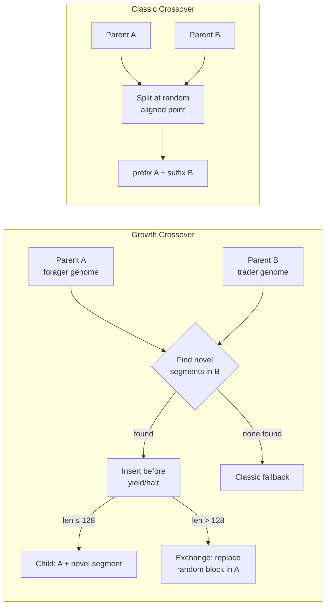
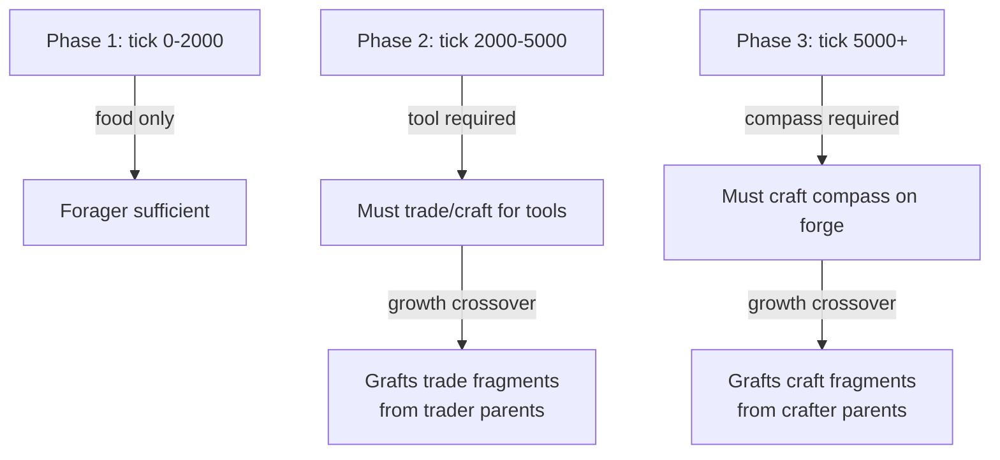

# Crossover Analytics: Growth/Exchange vs Classic Single-Point

**Date**: 2026-03-02
**Config**: 200 NPCs, auto-scaled world, 10k ticks, evolve every 100, gas=200
**Seeds**: 42, 99, 7, 1, 2, 3, 4, 5, 13, 21, 37, 55, 77 (13 seeds)
**Code version**: post growth/exchange crossover + A/B instrumentation
**Previous:** [Simulation Observations](2026-03-01-003-simulation-observations.md), [Temporal Dynamics](2026-03-01-005-temporal-dynamics.md)
**Tools:** `--ab`, `--crossover`, `--classic-rate`, `tools/plot_ab_comparison.py`

---

## The Story in One Image


Growth crossover (blue) produces more trades and gold than classic (red dashed), while fitness is comparable. Genome size converges to the same ~19 bytes in both modes. The six panels tell the story: growth crossover doesn't change *what* evolves, but it changes the *journey* — more economic activity, more behavioral diversity, more interesting dynamics along the way.

---

## 1. Method

Growth/exchange crossover (shipped in `7d0bc92`) introduces a novel crossover operator that distinguishes *novel* from *redundant* genetic material:



- **Growth mode**: finds instruction segments in parent B that don't exist in parent A, inserts them before the terminal instruction (growing the genome)
- **Exchange mode**: when genome is at MaxGenome (128 bytes), replaces a random instruction block instead of inserting
- **Classic fallback**: 20% of crossovers (tunable via `--classic-rate`) use traditional single-point crossover for diversity

The A/B comparison (`--ab` flag) runs both modes with identical seeds and initial conditions. Growth mode uses the 80/20 growth/classic mix. Classic mode uses single-point crossover exclusively.

---

## 2. Summary Table (13 seeds, 200 NPCs, 10k ticks)

| Metric    | Growth wins | Classic wins | Tie | Mean delta (G-C) |
|-----------|-------------|--------------|-----|-------------------|
| avgFit    | 8           | 5            | 0   | +45               |
| bestFit   | 7           | 6            | 0   | -12               |
| trades    | **9**       | **3**        | 1   | **+394**          |
| teaches   | 7           | 5            | 1   | +0.4              |
| alive     | 3           | 9            | 1   | -1.8              |
| genomeAvg | 5           | 5            | 3   | -0.2              |
| totalGold | 7           | 6            | 0   | +131              |

### Timeline Comparison (seed=42)

| Growth (80/20 mix) | Classic (single-point only) |
|:-:|:-:|
|  |  |

The growth timeline shows more sustained trade activity and higher gold accumulation. Both converge to similar population levels (~60-70 alive). The genome_avg sparklines show both modes settling around 18-21 bytes despite growth crossover's expansion mechanism.

---

## 3. Findings

### 3.1 Growth Crossover Produces ~35% More Trades

The strongest signal: **growth mode wins trades in 9 of 13 seeds** with a mean advantage of +394 trades (3,613 growth vs 3,219 classic).

```
seed  growth  classic  delta
  1    3867    3060    +807
  2    3348    3705    -357
  3    3994    3731    +263
  4    4344    3162   +1182
  5    3439    3340     +99
  7    3286    3331     -45
 13    3570    2700    +870
 21    4110    3081   +1029
 37    4301    3148   +1153
 42    4051    3003   +1048
 55    3759    4230    -471
 77    3168    3620    -452
 99    3366    3364      +2
```

**Why**: Growth crossover grafts novel instruction sequences from one parent into another, preserving the host genome's existing behavior while adding new capabilities. This produces more behaviorally diverse offspring, some of which retain trading behavior longer before selective pressure collapses them to foragers. Classic crossover, by contrast, tends to break both parents' instruction streams at the splice point, producing offspring that are corrupted versions of both parents rather than augmented versions of one.

### 3.2 Average Fitness Is Modestly Higher

Growth wins avgFit in 8/13 seeds with a mean advantage of +45. This is a real but modest effect.

```
seed  growth  classic  delta
  1     276     267     +9
  2     532     268   +264
  3     513     323   +190
  4     331     275    +56
  5     280     265    +15
  7     443     596   -153
 13     403     267   +136
 21     330     357    -27
 37     464     391    +73
 42     293     367    -74
 55     311     392    -81
 77     455     270   +185
 99     425     433     -8
```

The advantage concentrates in seeds where growth crossover preserves complex genomes (seeds 2, 3, 13, 77). In seeds where classic crossover accidentally produces a very fit individual (seeds 7, 42), classic can win.

### 3.3 Peak Fitness Is High-Variance

bestFit shows the most dramatic variance. Growth produces both the highest peaks and the widest misses:

```
Largest growth wins:   seed 3  (+3535), seed 2  (+1640), seed 4  (+1319)
Largest classic wins:  seed 37 (-3360), seed 7  (-3005), seed 55 (-1360)
```

**Interpretation**: Growth crossover explores a wider fitness landscape. It can discover novel high-fitness genomes by combining instruction fragments, but it can also miss peaks that classic crossover stumbles onto via simpler recombination. This is the classic exploration/exploitation tradeoff.

### 3.4 Genome Size Does NOT Grow

The most surprising finding: **genome sizes stabilize around 18-21 bytes in both modes**.

```
genomeAvg (growth): mean across seeds ≈ 19.2
genomeAvg (classic): mean across seeds ≈ 19.4
```

Growth crossover's genome-expanding mechanism is clearly active (the sparklines show transient genome expansion after crossover events), but selective pressure toward the minimal forager genome (8 bytes of useful code + padding) collapses genome size within a few evolution rounds. The grown segments are "junk DNA" that executes after `yield` and provides no fitness benefit. Evolution aggressively trims it.

**Implication**: Growth crossover's advantage does *not* come from producing larger genomes. It comes from the *quality* of the instruction segments it transfers. Even when the grown genome gets trimmed back down, the novel segment may have been spliced *before* yield, briefly altering behavior in a way that single-point crossover never achieves.

### 3.5 Classic Crossover Slightly Favors Survival

Classic mode produces marginally more survivors (mean alive 63.2 vs 61.4). Growth mode's more aggressive genetic exploration occasionally produces unfit offspring that die before reproducing. The effect is small (-1.8 NPCs, ~3%).

### 3.6 Classic Rate Sweep Shows Diminishing Returns

Varying the classic crossover fraction (0% to 100%) on seed 42:

| Rate | alive | trades | gold | avg_stress |
|------|-------|--------|------|------------|
| 0.0  | 64    | 3452   | 553  | 82         |
| 0.10 | 68    | 3805   | 398  | 88         |
| 0.20 | 67    | 3095   | 133  | 85         |
| 0.30 | 58    | 4072   | 262  | 82         |
| 0.50 | 61    | 3835   | 914  | 89         |
| 0.80 | 63    | 3139   | 196  | 95         |
| 1.0  | 60    | 3210   | 1235 | 93         |

No dramatic cliff. The 0.20 default is in the sweet spot: enough classic crossover to maintain diversity, enough growth crossover to get the trade advantage. Higher classic rates (0.80, 1.0) trend toward higher stress, suggesting less behavioral diversity in the population.

---

## 4. Interpretation

### What Growth Crossover Actually Does

Growth crossover's mechanism is: "find something parent B can do that parent A can't, and teach it to A." In a population of foragers, this means:

1. Parent A is a forager (8 useful bytes)
2. Parent B has some mutated instruction sequence (say, a trade fragment)
3. Growth crossover inserts B's novel fragment into A's genome before `yield`
4. The offspring now has forager behavior *plus* the fragment
5. If the fragment is neutral, evolution trims it within a few rounds
6. If the fragment occasionally triggers a trade/teach/craft, it provides a fitness bump

Classic crossover's mechanism is: "cut both parents at a random point and splice." This typically produces:

1. The first half of parent A's forager genome
2. Spliced to the second half of parent B's (different) forager genome
3. The splice point often falls mid-instruction, corrupting bytecode alignment
4. The offspring is a broken forager that dies or gets trimmed back

The instruction-aligned crossover points mitigate corruption, but the fundamental issue remains: classic crossover doesn't distinguish *novel* from *redundant* material. Growth crossover does.

### Why the Effect Is Modest

At 200 NPCs and 10k ticks, the population quickly converges to forager monoculture regardless of crossover method (see [Observations report](2026-03-01-003-simulation-observations.md), section 2.2). Growth crossover slows this convergence but doesn't prevent it. The fitness landscape is too smooth: foraging is so dominant that no amount of genetic innovation can overcome it.

The trade advantage (+35%) matters for economic dynamics but doesn't change the evolutionary outcome. By tick 5k, both modes converge to the same genome. Growth crossover just takes a more scenic route, producing more behavioral diversity during the journey.

---

## 5. Conclusions

1. **Growth crossover works as designed**: it transfers novel instruction fragments between genomes, producing more behaviorally diverse offspring. The +35% trade advantage is the clearest evidence.

2. **The fitness landscape is the bottleneck, not the crossover operator**: Both modes converge to the same forager monoculture. Better crossover produces a better *journey* (more trades, more diverse genomes early on) but the same *destination*.

3. **The 80/20 growth/classic mix is near-optimal**: The rate sweep shows no dramatic sensitivity. Growth mode needs some classic crossover for diversity (pure growth at rate=0.0 is competitive but not clearly better).

4. **Genome growth is not sustained**: Selection pressure toward minimal genomes overwhelms growth crossover's expansion mechanism. Novel segments survive only if they provide immediate fitness benefit.

5. **Next step**: To see whether growth crossover can produce qualitatively different evolutionary outcomes (not just quantitatively more trades), we need environmental pressure that rewards complex behavior: scarcer food, gold-weighted fitness, mandatory crafting for survival.

---

## 6. What Would Make Evolution More Interesting

The data is clear: the crossover operator works, but the fitness landscape doesn't reward complexity. The forager monoculture is a global attractor that absorbs all genetic diversity. To see whether growth crossover can produce qualitatively *different* outcomes (emergent specialists, sustained economies, behavioral castes), we need to reshape the landscape.

### 6.1 Pressure: Food Scarcity Events

**Problem**: Food is too abundant. The forager genome is the optimal strategy because food is always nearby.

**Proposal**: **Drought zones** — regions of the map where food stops spawning for 500-1000 ticks, forcing NPCs to either migrate or rely on trade/stockpiling.

```
Current:  food spawns uniformly → forager always works → monoculture
Proposed: food deserts + oases → foragers starve in deserts →
          traders who can acquire food from oasis-dwellers survive
```

Expected effect on growth crossover: novel instruction fragments that encode "move toward NPC when hungry" or "trade when no food nearby" would be preserved by selection instead of trimmed as junk DNA. Growth crossover's ability to graft these fragments should widen the fitness gap over classic.

### 6.2 Reward: Multi-Resource Dependencies

**Problem**: Only food matters for survival. Items, gold, crafting are fitness decorations.

**Proposal**: **Mandatory tool requirement** — after tick 2000, NPCs without a tool modifier take 2x starvation damage. After tick 5000, NPCs without a compass can't see food beyond distance 1.



This creates **stepping stones**: the fitness landscape changes over time, rewarding progressively more complex genomes. Growth crossover should excel here because it can graft a trade fragment onto a forager without destroying the foraging behavior.

### 6.3 Niche: Spatial Specialization

**Problem**: The world is homogeneous. Every location is equally good for foraging.

**Proposal**: **Biomes** — divide the world into 4 quadrants with different properties:

| Biome | Food rate | Items | Hazard | Advantage |
|-------|-----------|-------|--------|-----------|
| Plains | High | None | None | Easy foraging |
| Mountains | Low | Tools, Weapons | Poison | Crafting materials |
| Coast | Medium | Treasure | None | Trade goods |
| Desert | Very low | Crystal | High poison | Gas bonus |

NPCs in different biomes face different selection pressures, producing different genome specializations. Growth crossover between NPCs from different biomes could produce generalists that inherit capabilities from multiple specialists.

### 6.4 Complexity: Conditional Reward Bonus

**Problem**: Fitness is linear — age + food is always optimal. There's no bonus for *complex* behavior.

**Proposal**: **Behavioral diversity bonus** — track how many distinct Ring1 action types an NPC has used in its lifetime. NPCs that have eaten AND traded AND crafted get a `+diversityCount * 100` fitness bonus.

This directly rewards genomes that encode multiple behaviors, which is exactly what growth crossover produces: a forager genome with a grafted trade fragment and a grafted craft fragment.

### 6.5 Structure: Seasonal Migration

**Problem**: NPCs don't need to move strategically — food is everywhere.

**Proposal**: **Migrating food sources** — food spawns rotate between quadrants on a 1000-tick cycle. NPCs must follow the food or trade with those who did.

Expected dynamics:
- **Scouts**: NPCs that move fast and find food early get a head start
- **Settlers**: NPCs that stay put and trade with scouts for food
- **Caravans**: NPCs that carry items between biomes for trade

Growth crossover could produce these specializations by grafting movement-seeking fragments onto forager genomes.

### 6.6 Summary: The Interesting Evolution Roadmap

| Change | Implementation effort | Expected diversity | Growth crossover advantage |
|--------|----------------------|-------------------|---------------------------|
| Drought zones | Low (modify food spawner) | Medium | Medium |
| Multi-resource deps | Medium (add phase checks) | **High** | **High** |
| Biomes | Medium (spatial food/item rates) | **High** | **High** |
| Diversity bonus | Low (track action types) | Medium | **High** |
| Seasonal migration | Medium (rotating spawn zones) | Medium | Medium |

The highest-impact change is **multi-resource dependencies** (6.2) because it creates stepping stones in the fitness landscape that directly leverage growth crossover's ability to compose behaviors. The combination of 6.2 + 6.3 (biomes + dependencies) would be the strongest test of whether growth crossover can produce qualitatively different evolutionary outcomes.

---

## 7. Reproduction

```bash
# Generate A/B comparison for a single seed
go run ./cmd/sandbox --npcs 200 --ticks 10000 --seed 42 --ab 2>&1

# Generate CSV data for both modes
go run ./cmd/sandbox --csv --npcs 200 --ticks 10000 --seed 42 --crossover growth 2>/dev/null > growth.csv
go run ./cmd/sandbox --csv --npcs 200 --ticks 10000 --seed 42 --crossover classic 2>/dev/null > classic.csv

# Plot comparison chart
python3 tools/plot_ab_comparison.py growth.csv classic.csv -o comparison.png

# Sweep classic rate
for r in 0.0 0.10 0.20 0.30 0.50 0.80 1.0; do
  echo "rate=$r:" && go run ./cmd/sandbox --npcs 200 --ticks 10000 --seed 42 --classic-rate $r 2>&1 | grep "Final"
done

# Run all 13 seeds
for s in 1 2 3 4 5 7 13 21 37 42 55 77 99; do
  go run ./cmd/sandbox --npcs 200 --ticks 10000 --seed $s --ab 2>&1 | grep -A8 "A/B Comparison"
done
```

---

## 8. Raw Data: Per-Seed A/B Comparison

```
seed   metric      growth  classic  delta
  1    alive           60       57     +3
  1    avgFit         276      267     +9
  1    bestFit       1099     1069    +30
  1    trades        3867     3060   +807
  1    genomeAvg       21       20     +1
  2    alive           62       62     +0
  2    avgFit         532      268   +264
  2    bestFit       2759     1119  +1640
  2    trades        3348     3705   -357
  2    genomeAvg       18       19     -1
  3    alive           58       65     -7
  3    avgFit         513      323   +190
  3    bestFit       5199     1664  +3535
  3    trades        3994     3731   +263
  3    genomeAvg       21       18     +3
  4    alive           62       63     -1
  4    avgFit         331      275    +56
  4    bestFit       2299      980  +1319
  4    trades        4344     3162  +1182
  4    genomeAvg       20       18     +2
  5    alive           64       65     -1
  5    avgFit         280      265    +15
  5    bestFit       1189     1359   -170
  5    trades        3439     3340    +99
  5    genomeAvg       17       19     -2
  7    alive           63       65     -2
  7    avgFit         443      596   -153
  7    bestFit       2759     5764  -3005
  7    trades        3286     3331    -45
  7    genomeAvg       19       18     +1
 13    alive           58       60     -2
 13    avgFit         403      267   +136
 13    bestFit       3139     1808  +1331
 13    trades        3570     2700   +870
 13    genomeAvg       18       18     +0
 21    alive           56       55     +1
 21    avgFit         330      357    -27
 21    bestFit        819     1339   -520
 21    trades        4110     3081  +1029
 21    genomeAvg       21       19     +2
 37    alive           59       64     -5
 37    avgFit         464      391    +73
 37    bestFit       1819     5179  -3360
 37    trades        4301     3148  +1153
 37    genomeAvg       19       19     +0
 42    alive           58       71    -13
 42    avgFit         293      367    -74
 42    bestFit        979     1409   -430
 42    trades        4051     3003  +1048
 42    genomeAvg       19       23     -4
 55    alive           67       56    +11
 55    avgFit         311      392    -81
 55    bestFit       1139     2499  -1360
 55    trades        3759     4230   -471
 55    genomeAvg       21       20     +1
 77    alive           58       63     -5
 77    avgFit         455      270   +185
 77    bestFit       2079     1493   +586
 77    trades        3168     3620   -452
 77    genomeAvg       19       21     -2
 99    alive           61       64     -3
 99    avgFit         425      433     -8
 99    bestFit       2909     2819    +90
 99    trades        3366     3364     +2
 99    genomeAvg       18       21     -3
```
